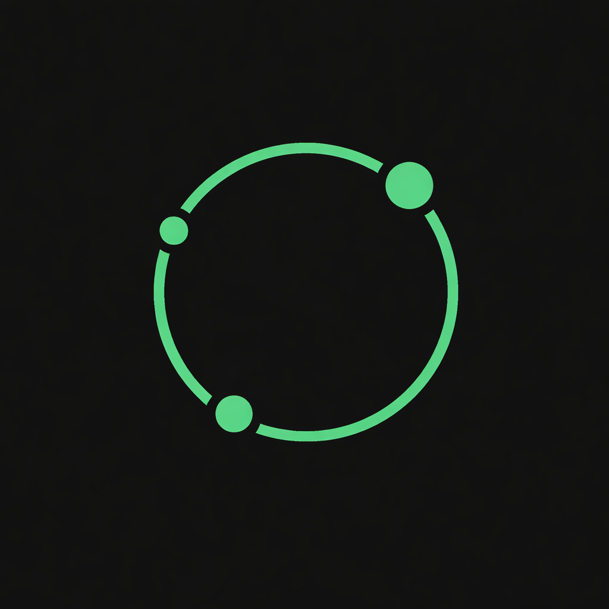
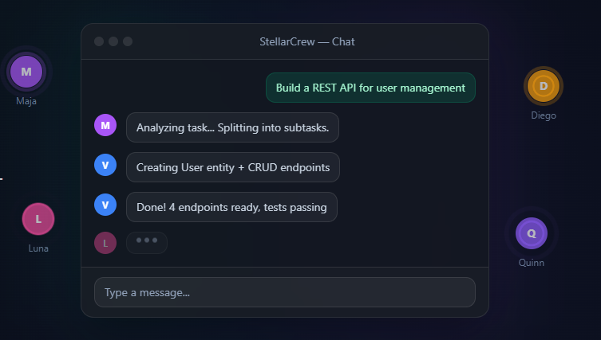
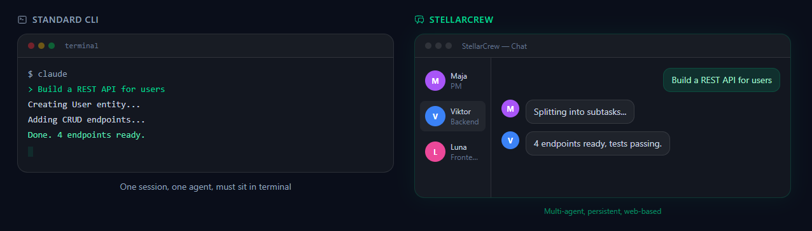
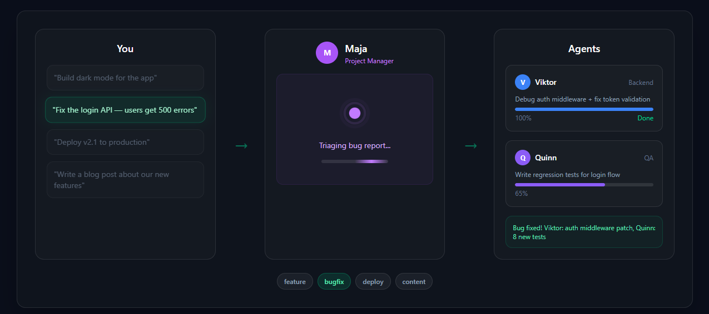
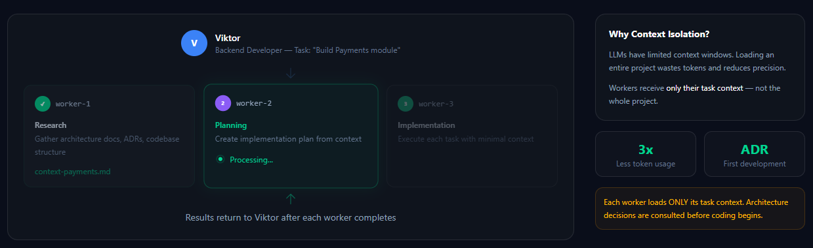

<p align="center">
  
</p>

<h1 align="center">StellarCrew</h1>

<p align="center">
  <strong>AI Agent Orchestration Platform</strong><br>
  Self-hosted. Built on Claude Code CLI. Open Source.
</p>

<p align="center">
  <a href="https://stellarcrew.dev">Website</a> &middot;
  <a href="#features">Features</a> &middot;
  <a href="#roadmap">Roadmap</a> &middot;
  <a href="#quick-start">Quick Start</a> &middot;
  <a href="#license">License</a>
</p>

<p align="center">
  
  
  
  
  
</p>

---

> **MVP Coming Soon** — Star the repo to get notified when we launch.

<p align="center">
  
</p>

## What is StellarCrew?

StellarCrew is a **self-hosted AI agent orchestration platform** built on top of [Claude Code CLI](https://docs.anthropic.com/en/docs/claude-code). It reverses the standard MCP flow — instead of sitting in a terminal, you manage everything from a **web panel**.

Think of it as a control center for your AI team:
- **PM agent** analyzes tasks and dispatches to specialists
- **Developer agents** write code, fix bugs, deploy
- **Content agents** write blog posts, social media, documentation
- **DevOps agents** monitor infrastructure, run health checks

All from one dashboard. No terminal required.

## Features

| Feature | Status | Description |
|---------|--------|-------------|
| **Reversed MCP** | MVP | Web panel controls Claude Code CLI in the background |
| **Agent Orchestration** | MVP | PM dispatches tasks to specialized agents |
| **Multi-Agent Chat** | MVP | Chat with any agent from the browser |
| **Terminal Pairing** | MVP | Pair CLI terminals from any machine |
| **Human-in-the-Loop** | MVP | Approve critical actions from the dashboard |
| **Voice Chat** | MVP | Speech-to-text input, text-to-speech output |
| **Scheduled Tasks** | MVP | Autopilot triggers agents on schedule |
| **Security** | MVP | Killswitch, token auth, scope restrictions, firewalls |
| **Multi-Terminal** | MVP | Run agents on multiple machines simultaneously |
| **Telegram** | MVP | Manage agents from Telegram |
| **Project Autopilot** | Phase 1 | Milestones, auto-task progression |
| **Multi-Provider LLM** | Phase 1 | Anthropic, OpenRouter, OpenAI, local models |
| **Context Isolation** | Phase 1 | Worker spawning with minimal context |
| **Flow Builder** | Phase 2 | Visual drag & drop workflow editor |
| **Agent Marketplace** | Phase 2 | Community agent templates |

## How It Works

<p align="center">
  
</p>

**Standard MCP:**
```
[User in Terminal] → [Claude Code] → [MCP Tools]
```

**StellarCrew (Reversed MCP):**
```
[Web Panel] → [StellarCrew API] → [MCP Gateway] → [Claude Code CLI]
     ↑                                                        │
     └──────────────────── response ──────────────────────────┘
```

User writes in the web panel. API queues the message. MCP delivers it to Claude Code CLI. The agent processes the request and sends the response back to the web panel. Fully async, fully managed.

### Agent Orchestration

<p align="center">
  
</p>

PM agent receives your task, analyzes it, splits it into subtasks, and dispatches to the right specialists. Each agent works in parallel with progress tracking.

### Context Isolation

<p align="center">
  
</p>

Agents spawn specialized workers with isolated context. Each worker receives only what it needs — no token waste, maximum precision. ADR-first development built in.

## Tech Stack

| Layer | Technology |
|-------|------------|
| Backend | Symfony 8, PHP 8.3 |
| Frontend | React 19, TypeScript, TailwindCSS 4 |
| Database | PostgreSQL |
| Queue | RabbitMQ |
| Cache | Redis |
| AI Engine | Claude Code CLI (Anthropic) |
| Infrastructure | Docker, Docker Compose |

## Quick Start

```bash
git clone https://github.com/szymilab-b13/stellarcrew-v2.git
cd stellarcrew-v2
docker compose up -d
```

> **Note:** MVP is not released yet. Star the repo to get notified.

## Roadmap

### MVP (Coming Soon)
- [x] Project structure (Symfony 8 + React 19 + Docker)
- [ ] MCP AI Gateway (reversed flow)
- [ ] Multi-agent chat with web panel
- [ ] Agent orchestration (PM dispatches)
- [ ] Terminal pairing & management
- [ ] Human-in-the-loop approvals
- [ ] Voice chat (TTS + STT)
- [ ] Scheduled tasks
- [ ] Security: killswitch, tokens, scopes
- [ ] Multi-terminal support
- [ ] Telegram integration

### Phase 1 (Next)
- [ ] Project autopilot with milestones
- [ ] Multi-provider LLM support
- [ ] Context isolation (worker spawning)
- [ ] Slack integration
- [ ] Smart message prioritization

### Phase 2 (Later)
- [ ] Visual Flow Builder
- [ ] Agent marketplace / templates
- [ ] Discord & WhatsApp integrations
- [ ] Multi-user collaboration
- [ ] RBAC (Role-based access control)

## License

This project is licensed under the [GNU Affero General Public License v3.0](LICENSE).

- Free for personal and non-commercial use
- If you modify and offer it as a service (SaaS), you must publish your source code
- **Commercial use requires a separate license** — [contact us](mailto:bieleckitomasz94@gmail.com)

For licensing inquiries: [bieleckitomasz94@gmail.com](mailto:bieleckitomasz94@gmail.com)

## Contact

- **Website:** [stellarcrew.dev](https://stellarcrew.dev)
- **Email:** [bieleckitomasz94@gmail.com](mailto:bieleckitomasz94@gmail.com)
- **GitHub:** [github.com/szymilab-b13/stellarcrew-v2](https://github.com/szymilab-b13/stellarcrew-v2)

---

<p align="center">
  <strong>Star the repo</strong> to support the project and get notified when MVP launches.
</p>
